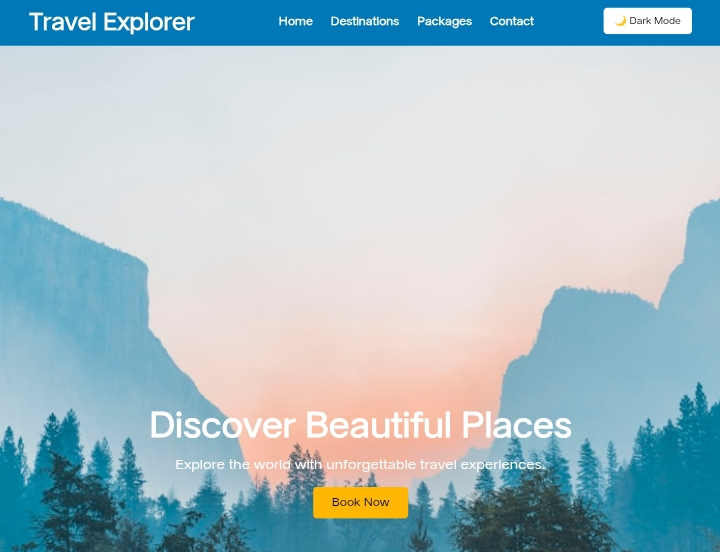
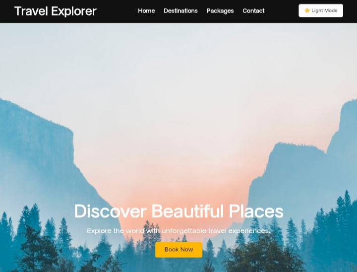
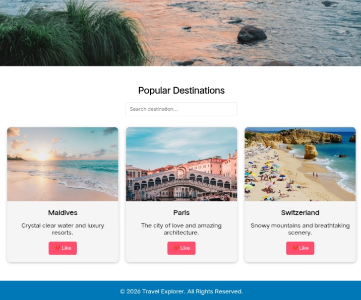
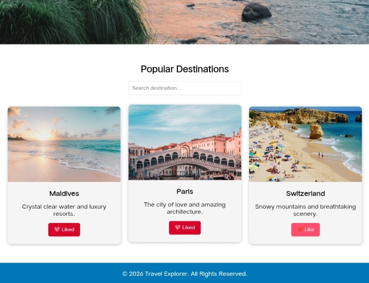

# frontend-project-3
# Travel Explorer

## Description

Travel Explorer is a responsive travel website created using HTML, CSS, and JavaScript. It allows users to explore popular destinations and includes interactive features such as Dark Mode, destination search, and like buttons.

## Features

- Responsive design
- Dark Mode toggle
- Destination search
- Like button interaction
- Book Now button

## Technologies Used

- HTML5
- CSS3
- JavaScript

## Files

- index.html
- style.css
- script.js

## screenshots

Dark Mode toggle

Like button interaction

## Author

Faseeha Thajudeen

